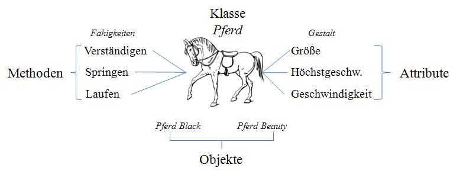
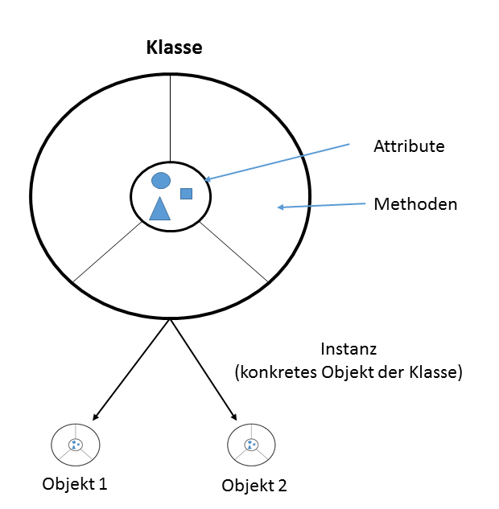
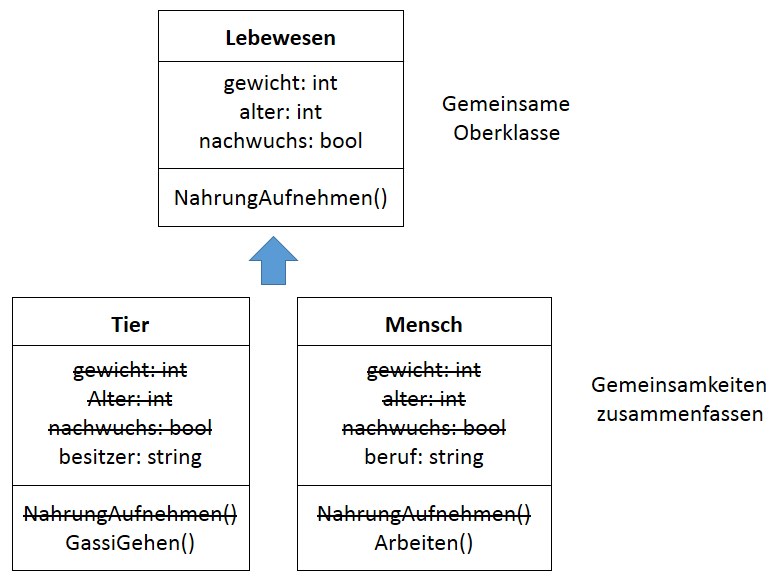

# Objektorientierung
Klassen, Objekte und Instanzen


<!-- .slide: class="left" -->
## Hintergrund der objektorientierten Programmierung

**Definition Objektorientierung**: Eine Sichtweise auf ein System, das durch das Zusammenspiel kooperierender Objekte beschrieben wird.

* Zusammengehörende Teile werden beim programmieren zusammen verwaltet.
* Um zur Lösung eines Problems zu kommen, versucht man einzelne Objekte (Klassen) in der Problemstellung zu erkennen.
* Die Objekte werden mit den zugehörigen Daten und Methoden, die sie beschreiben, nachgebildet.


<!-- .slide: class="left" -->
## Vorteile der objektorientierten Programmierung

* Der Schutz von Daten verbessert sich durch die Kapselung der Daten und Methoden.
* Die Fehlersuche wird durch die kompakte Struktur der Objekte vereinfacht.
* Quellcode wird überschaubarer.
* Änderungen können einfacher vorgenommen werden.
* Neue Klassen können leichter in die Anwendung eingebunden werden.
* Objekte werden nur dann erzeugt wenn diese benötigt werden (Effizienter Umgang mit Speicherplatz).


<!-- .slide: class="left" -->
## Objektorientierung



Mehr zum Thema [objektorientierte Programmierung](https://entwickler.de/online/development/einfuehrung-programmierung-objektorientierte-programmentwicklung-197372.html)


<!-- .slide: class="left" -->
# Klassen

*Eine Klasse ist ein Modell auf dessen Basis Objekte erstellt werden.*

* In einer Klasse werden Attribute und zugehörige Methoden vereint.

* Da die Attribute und Methoden zur Klasse gehören spricht man von **Klassenmember**.

* Objekte (Instanzen) stellen konkrete Exemplare der Klasse dar.

* Auf Basis einer Klasse können beliebig viele Objekte erzeugt
    (instanziiert) werden.


<!-- .slide: class="left" -->
## Syntax der Klassendefinition

* Die Klassendeklaration beginnt mit dem Schlüsselwort **class**.

* Bei Bedarf kann ein Zugriffsmodifizierer vorangestellt werden. Wird keiner vorangestellt, wird die Klasse als **internal** deklariert.

* Anschließend folgt der Klassenname, dieser beginnt üblicherweise mit einem Großbuchstaben.

* In der geschweiften Klammer folgt die Definition der Member.

* Eine Klasse kann Variablen, Konstante und Methoden enthalten.

* Auch den Klassenmember können Modifizierer vorangestellt werden. Ohne Angabe werden die Elemente als **private** deklariert.

* Mehr zum Thema [Klassen](https://docs.microsoft.com/de-de/dotnet/csharp/programming-guide/classes-and-structs/classes)


<!-- .slide: class="left" -->
## Zugriffsmodifizierer

Die Zugriffsmodifizierer steuern die Sichtbarkeit der Variablen, Eigenschaften und
Methoden einer Klasse in C\#. Sie heißen:

**private:**

* Der Zugriff auf das Element ist nur innerhalb der Klasse möglich.

**protected:**

* Zugriff innerhalb der Klasse und von allen davon abgeleiteten Klassen.

**internal:**

* Der Zugriff auf das Element ist innerhalb der Assembly (Programm, Klassenbibliothek) möglich.

**public:**

* Der Zugriff auf das Element ist nicht eingeschränkt.


<!-- .slide: class="left" -->
## Unsere erste Klasse

```csharp
public class Person // Variablen und Methoden
{
    private string vorname;
    private string nachname;
    public int alter;

    public string GetName()
    {
        return vorname + " " + nachname;
    }
}
```


<!-- .slide: class="left" -->
## Klasseninstanzen (Objekte) erzeugen

* In C\# werden Instanzen einer Klasse **immer** dynamisch mit **new** erzeugt.

* Speicherplatz wird erst beim Anlegen der Instanzen reserviert.

* Erzeugen eines Objekts:

```csharp
Person meinePerson;
meinePerson = new Person();
```


<!-- .slide: class="left" -->
## Zugriff auf die Member eines Objekts

Der Zugriff auf die Member (Attribute) eines Objekts erfolgt über den
Punktoperator.

```csharp
meinePerson.alter = 20;
```

Note: **VS** Klasse erzeugen und nutzen. IN **VS** zeigen, Sichtbarkeit von Variablen (Klassenvariable, Variable in Methode, in Schleife)


<!-- .slide: class="left" -->
## Was ist Kapselung

* Die Attribute (Variablen) werden in einer Klasse eingeschlossen und nach außen abgeschirmt (mit Zugriffsmodifizierer).

* Nur Methoden und Eigenschaften (Properties) einer Klasse haben darauf Zugriff.

* Werte können beim schreiben geprüft und verändert werden.

* Werte können beim lesen verändert und aufbereitet werden.

Note: Prüfen auf Schwellwerte oder entfernen von Leerzeichen


<!-- .slide: class="left" -->
## Darstellung Kapselung



Note: Variabeln sind nur intern nutzbar wenn diese private sind

Methoden sind meist nach außen sichtbar und greifen auf die geschützten Variablen zu.

ÜBUNG Medienverwaltung 1


<!-- .slide: class="left" -->
## Eigenschaften

Um die Kapselung zu erreichen werden die Attribute **private**
deklariert. Der Zugriff erfolgt über eine [Property (Eigenschaft)](https://docs.microsoft.com/de-de/dotnet/csharp/programming-guide/classes-and-structs/properties).

```csharp
public class Person
{
    private string vorname;
    private string nachname;
    private int alter;

    public int Alter // Eigenschaft (Property)
    {
        get {return alter;}
        set {alter = value;} // value beinhaltet den übergebenen Wert
    }

    // Alternative expression-bodied members (return nicht notwendig)
    //public int Alter
    //{
    //    get => alter;
    //    set => alter = value;
    //}

    // Alternative automatic Property
    // public int Alter { get; set; }
}
```

Note: **VS** Eigenschaft zeigen mit automa. Generierung

Zuweisung von Wert wie bei einer Variable (nicht a.SetName("aa"))

In einer Eigenschaft sind getter und setter inkludiert.

<!-- .slide: class="left" 
## Klassen- & Instanzvariablen

Je nach Gültigkeit unterscheidet man in Instanz- und Klassenvariablen.\
Der Unterschied ist gut zu erkennen am Beispiel eines Objektzählers.

* **Instanzvariablen**
    Variablen die nur innerhalb von Objekten gültig sind.

```csharp
public int count;
```

* **Klassenvariablen**
Variablen die unabhängig von Objekten existieren.

```csharp
public static int classCount;
```

**Zugriff außerhalb der Klasse:**

```csharp
Person meinObjekt = new Person();
int c = meinObjekt.count;
int cClass = Person.classCount;
```
-->


<!-- .slide: class="left" -->
## Objektreferenz - THIS

* Zusammen mit jedem Objekt wird vom Compiler automatisch eine Objektreferenz auf das eigene Objekt erzeugt.

* Diese Referenzvariable [this](https://docs.microsoft.com/de-de/dotnet/csharp/language-reference/keywords/this) kann in allen Methoden des Objekts eingesetzt werden.

* Kennzeichnet das aktuelle Objekt.

Note: Sich selbst als Parameter übergeben.

Identifizieren von Variablen mit gleichem Namen


<!-- .slide: class="left" -->
### Beispiel

```csharp
using System;

namespace Objektreferenz
{
    class Person
    {
        private string vorname;
        private string nachname;
        private int alter;

        public void Anlegen(string vorname, string nachname, int alter)
        {
            this.nachname = nachname;
            this.vorname = vorname;
            this.alter = alter;
        }
    }

    class Program
    {
        static void Main(string[] args)
        {
            Person hugo = new Person();
            hugo.Anlegen("Hugo", "Musterhugo", 33);
            Console.Read();
        }
    }
}
```


<!-- .slide: class="left" -->
# Konstruktor & Destruktor

Jede Klasse enthält mindestens einen Konstruktor und einen Destruktor/Finalizer.
Bei der Erzeugung eines Objekts wird automatisch der Konstruktor
aufgerufen. Innerhalb des Konstruktors können dann zum Beispiel
Attribute der Klasse initialisiert oder Variablen mit Standardwerten
belegt werden.

Der Destruktor zerstört die vom Konstruktor erzeugte Instanz des Objekts
und gibt somit den Speicherplatz wieder frei.

Der Compiler stellt für jede Klasse automatisch einen parameterlosen
Konstruktor und Destruktor bereit. Es können eigene Konstruktoren und Destruktoren, mit erweiterter Funktionalität, programmiert werden.


<!-- .slide: class="left" -->
## Konstruktor

* Der Konstruktor ist eine spezielle Methode einer Klasse (kann aber nicht manuell aufgerufen werden)

* Der Konstruktor wird **automatisch beim Instanziieren** (Erzeugen) eines Objekts aufgerufen.

* Wird innerhalb der Klasse vom Programmierer **kein Konstruktor formuliert**, so wird automatisch der **Standard-Konstruktor** (ohne Parameter) aufgerufen.


<!-- .slide: class="left" -->

* Der Konstruktor ist eine Methode, die **immer** den Namen der Klasse besitzt.

* Er liefert **keinen** Wert zurück, **auch nicht void!**

* Er kann nicht wie eine andere Methode aufgerufen werden, sondern wird immer automatisch beim Erzeugen eines Objekts aufgerufen.

* Der Konstruktor ist außerhalb der Klasse aufrufbar; deshalb **muss** er als **public** definiert werden.

* Auch Konstruktoren können überladen werden, es können verschiedene Parameterlisten mitgegeben werden.<br/>
--> Bei der Erzeugung eines Objekts **müssen die Parameter mit übergeben werden**.

* Mehr zum Thema [Konstruktoren](https://docs.microsoft.com/de-de/dotnet/csharp/programming-guide/classes-and-structs/constructors)

Note: private Konstruktor: wenn die Klasse nicht initialisiert werden soll


<!-- .slide: class="left" -->
### Syntax

**Standard-Konstruktor welcher automatisch aufgerufen wird:**

```csharp
class Person
{
    //Standard-Konstruktor. Gleicher Name wie die Klasse und kein Rückgabewert
    public Person()
    {
    }
}
```

**Definition des Standard-Konstruktor:**

```csharp
string name;
string vorname;

public Person()
{
    //Initialisierung mit festen Werten
    name = "Name unbekannt";
    vorname = "Vorname unbekannt";
}
```


<!-- .slide: class="left" -->
### Beispiel Konstruktor

```csharp
    class Person
    {
      private string name;
      private string vorname;

      public Person()  //Standardkonstruktor
      {
        name = "unbekannt";
        vorname = "unbekannt";
      }

      public Person(string nachname, string vorname)
      {
        name = nachname;
        this.vorname = vorname;
      }
    }
```

Note: Werden Konstruktoren definiert gibt es kein Default Konstruktor mehr


<!-- .slide: class="left" -->
### Beispiel

```csharp
namespace BeispielKonstruktor
{
    class Fahrzeug
    {
        private int aktuelleGeschwindigkeit;

        public int Geschwindigkeit // Property
        {
            get { return this.aktuelleGeschwindigkeit; }
            set { this.aktuelleGeschwindigkeit = value; }
        }

        public Fahrzeug(int wert)
        {
            Geschwindigkeit = wert;
        }

        public Fahrzeug() : this(50) //Verweis auf Konstruktor mit einem Paramter
        {
        }
    }

    class Program
    {
        static void Main(string[] args)
        {
            Fahrzeug audi = new Fahrzeug();
            Fahrzeug bmw = new Fahrzeug(38);
            Console.WriteLine($"Geschwindigkeit Audi: {audi.Geschwindigkeit} km/h");
            Console.WriteLine("Geschwindigkeit Bmw: " + bmw.Geschwindigkeit + " km/h" );
        }
    }
}
```

Note: Anderer überladener Konstruktor wird zuerst mit this aufgerufen. Danach wird der restliche Code durchlaufen.

Initialisierungscode sollte in nur einem Konstrukt sein der von anderen aufgerufen wird.

**VS** Konstruktor zeigen (Klasse erstellen mit zwei Konstruktoren. Der  Konstruktor mit einem Wert ruft anderen Konstruktor mit zwei Werten auf)


<!-- .slide: class="left" -->
## Destruktor (Finalizer)

* Der Destruktor einer Klasse wird beim **Zerstören** eines Objekts aufgerufen.

* Er besitzt **keine Parameter**, keine Zugriffsmodifizierer und kann **nicht überladen** werden.

* Destruktoren werden verwendet, wenn vor der Zerstörung des Objekts noch Aktionen ausgeführt werden müssen.

* Freigabe von dynamisch allokiertem Speicher oder Abspeichern einer Datei vor dem Schließen.

* Der Destruktor besitzt den selben Namen wie die Klasse nur mit vorangestellter Tilde "\~".

* Er kann nicht direkt aufgerufen werden.

* Mehr zum Thema [Destruktor/Finalizer](https://docs.microsoft.com/de-de/dotnet/csharp/programming-guide/classes-and-structs/destructors)


<!-- .slide: class="left" -->
### Syntax

```csharp

class Person
{
    ...
    // Destruktor
    ~Person()
    {
    }
}
```

Note: ÜBUNG Intervall und Sekundenspeicher


<!-- .slide: class="left" -->
# Vererbung

## Problemstellung

Oft werden mehrere Klassen benötigt, die in weiten Teilen gleiche Funktionalitäten bereitstellen und gleiche Eigenschaften haben.

Zum Beispiel bei den Klassen **Mensch** und **Tier**.

* viel Schreibarbeit

* bei Änderungen müssen alle Klassen angepasst werden

**Lösung:**

Man versucht, zu ähnlichen Klassen, eine gemeinsame **Oberklasse** zu finden die alle Gemeinsamkeiten beinhaltet. In den **Unterklassen** werden lediglich die Unterschiede ergänzt.


<!-- .slide: class="left" -->
## Vererbung




<!-- .slide: class="left" -->
## Vererbung
Die Vererbung (Ableitung) erlaubt die Definition neuer Klassen auf der
Basis von bestehenden Klassen. Dabei werden Eigenschaften und Methoden
übernommen.

Die Klasse deren Member vererbt werden, wird **Basisklasse/Elternklasse/Oberklasse** genannt, und die Klasse, die diese Member erbt, wird **abgeleitete Klasse/Kindklasse/Unterklasse** genannt.

**Beispiel:** Eine Basisklasse **Lebewesen** kann eine abgeleitete
Klasse **Tier** und eine weitere abgeleitete Klasse **Reptil** haben.
Also ein Reptil ist ein Tier und ein Tier ist ein Lebewesen.

Note: Autohaus

Auto        LKW

Audi    BMW

A1  A3  A4


<!-- .slide: class="left" -->
## Beispiel


Note: **Ist ein** oder **ist eine Art von**

Assoziation = Beziehung keine Vererbung

ÜBUNG Klassendiagramm


<!-- .slide: class="left" -->
## Beispiel


Note: Konstruktor und private Elemente werden nicht vererbt.

ChangeRequest kann alle Methoden und Variabeln von der Basisklasse verwenden

**VS** zeigen in Vererbung


<!-- .slide: class="left" -->
## Syntax

```csharp
class <abgeleitete Klasse> : <Basisklasse>
{
    ...
}
```

Die Implementierung der Vererbung in C\#

```csharp
class Mensch : Lebewesen
{
    ...
}
```

Note: In **VS** zeigen:

* Reihenfolge von Konstruktoraufrufe
* readonly Schlüsselwort
* protected
* region --> wenn Gliederung in VS aktiv ist
* Klasse erstellen mit zwei Methoden
* Aufruf der Methoden
* Aufruf Konstruktor

ÜBUNG Medienverwaltung 2


<!-- .slide: class="left" -->
## Konstruktoren

* Es werden keine Konstruktoren vererbt!

* Von der Kindklasse wird der parameterlose Konstruktor der Basisklasse aufgerufen wenn kein anderer Konstruktor definiert wurde.

* Besitzt die Basisklasse einen Konstruktor mit Parameter (und keinen ohne Parameter) wird dieser nicht aufgerufen. In diesem Fall muss (wenn ein Konstruktor nötig ist) der Konstruktor aus der abgeleiteten Klasse explizit aufgerufen werden.

```csharp
:base(Parameter)
```


<!-- .slide: class="left" -->
## Klassenkonzept


<!-- .slide: class="left" -->
Um aus einer abgeleiteten Klasse auf die Basisklasse zuzugreifen gibt es
das Schlüsselwort **base**:

* Einen Konstruktor der Basisklasse aufrufen:

```csharp
public Person(string beruf, string name, int alter) : base(name, alter)
```

* Auf eine Methode oder Eigenschaft der Basisklasse zugreifen:

```csharp
base.Name = "Fritz";
```


<!-- .slide: class="left" -->
## Weitere Schlüsselworte

* **virtual:** Wird ein Klassenmember in der Basisklasse mit virtual deklariert kann er später von einer abgeleiteten Klasse überschrieben werden.

* **override:** Überschreibt einen Klassenmember der als virtual deklariert wurde (erweitert bzw ändert Funktion der Basisklasse). Die zuletzt überschriebene Methode wird immer benutzt!

* **new Modifizierer:** Überdeckt (versteckt) Methoden der Basisklasse. Wird, je nachdem welcher Datentyp das Objekt besitzt, aufgerufen oder nicht.

* **sealed:** Eine als sealed deklarierte Klasse erlaubt keine Ableitung. z.B. verhindert in einer API.

* **abstract:** Damit kann angegeben werden dass die Klasse nur als Basisklasse verwendet werden kann (es darf keine Instanz erstellt werden). Klassen die von einer abstrakten Klasse erben müssen alle Klassenmember die abstract sind implementieren. Haben keine Implementierung von Code sondern nur die Definition!

Note: **VS** Vererbung virtual

New Modifizierer: Zeigt an das der Member neu deklariert und in der Basisklasse verborgen wird.

ÜBUNG Versandhandel. Davor wdh von Klassen + Vererbung + Properties