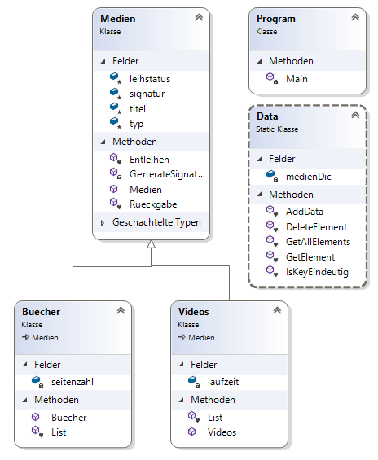

# Übung 12 - Medienverwaltung Aufgabe 3

# Teil 1

## Objekte speichern
Nun können mehrere Objekte einer Klasse existieren. Z.b. 2 Video und 3 Bücher Objekte. Der Bestand der Bibliothek soll in einer „Collection“ temporär (nur zur Laufzeit des Programms) gespeichert werden.

**Die Collection beinhaltet alle Objekte.**

## Prüfen und Vergabe der Signatur

Als weiterer Schritt soll die Signatur automatisch (Zufallszahlen) erstellt werden. Nutzen Sie die Klasse Random.

```csharp
Random random = new Random();
int signatur = random.Next(Zahlen von, Zahlen bis);
```

Prüfen Sie ob eine Signatur bereits existiert. Wenn ja eine neue Zufallszahl generieren.

## zusätzliche Kommandos

|Kommando    | Aktion
-------------|----------
|„l“| Titel können eine beliebige Länge haben. Bei der Ausgabe soll die Spaltenstruktur aber erhalten bleiben. Schneiden Sie die Titel bei der Ausgabe entsprechend ab.|
|„d Signatur“| Löschen des durch die Signatur bezeichneten Objekts. z.B. d 2234|

# Teil 2

Die Daten werden aktuell in einer Collection temporär vom Programm gespeichert. Wenn kein Dictionary benutzt wurde dies darauf umstellen.

`private static Dictionary<int,Medien> medienDic = new Dictionary<int, Medien>();`

Um Objekte in das Dictionary aufzunehmen, nutzen Sie als Key die Signatur und als Wert das Objekt Medien.

Um eine übersichtliche Datentrennung und auch später eine einfachere Erweiterung zu gewährleisten sollen alle Methoden und Aufrufe welche die Collection betreffen in eine neue "Data" Klasse ausgelagert werden. Die Klasse und alle ihre Member sollen static deklariert sein. Damit ist ein Aufruf der Methoden ohne Instanz der Klasse möglich.

Die benötigten Methoden entnehmen Sie dem Klassendiagramm. Alle „Datenzugriffe“ müssen in der Klasse Data gekapselt werden, d.h. es soll nach außen nicht ersichtlich sein wo bzw. mit welcher Struktur die Daten gespeichert werden.
Somit könnte man im späteren Verlauf das Dictionary z.B. durch eine Datenbankanbindung ersetzen und muss nur die Klasse „Data“ bearbeiten.

## Klassendiagramm

