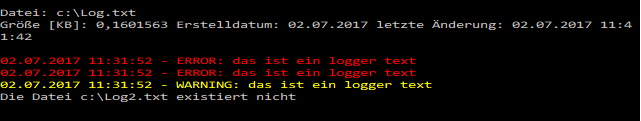
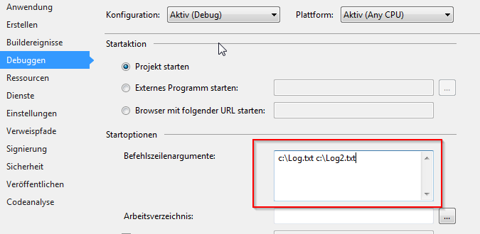

# Übung 15 - Dateien einlesen

Es sollen bestehende Logdateien (bzw. Textdateien) in einer Konsolenanwendung eingelesen bzw. ausgegeben werden.

Die auszugebenden Dateien sollen als Parameter der Anwendung übergeben werden. D.h. der Pfad soll nicht im Programm eingegeben werden. Es können auch mehrere Dateien übergeben werden. Nutzen sie hierzu das „string[] args Array“ der Main Methode.

## Folgende Funktionen sollen implementiert werden

* Prüfen Sie ob die Datei existiert
* Es sollen nur Textdateien akzeptiert werden (z.B. log und txt). Ist die übergebene Datei nicht gültig soll eine Meldung erscheinen und das Programm mit der nächsten Datei weiterarbeiten.
* Am Anfang vor jeder Dateiausgabe eine Art Dateiinfo ausgeben

    * Größe in KB,
    * Erstelldatum (nur Datum)
    * letzte Bearbeitung

* Danach alle Zeilen ausgeben:

    * Wurde ein Log Status (so wie bei unserer Logger Übung) hinterlegt soll zu jedem Status eine Farbe hinterlegt werden. z.b. mit: `Console.ForegroundColor = ConsoleColor.Red;`
    * Die Ausgabe mit der entsprechenden Farbe versehen.

## Beispiel

## Hinweis

Um solch ein Projekt einfach zu debuggen gibt es die Möglichkeit dem Debugger Übergabeparameter mitzugeben.

