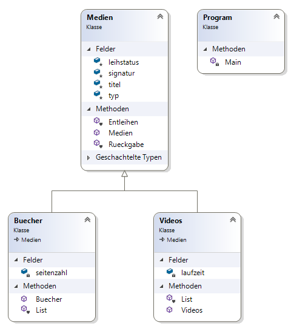
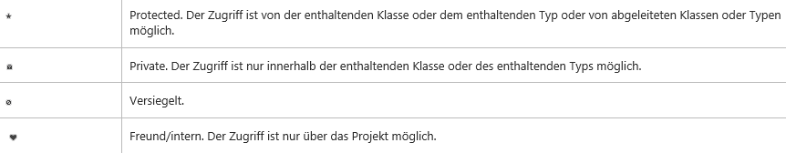

# Übung 8 - Medienverwaltung Aufgabe 2

## Teil 1 - Vererbung

Die in Aufgabe 1 begonnene Bibliothek verwaltet nun keine Standard-Medien sondern nur noch:

* Bücher, die neben Signatur, Titel und Leihstatus zusätzlich eine Seitenzahl besitzen

* Videos, die zusätzlich eine Spieldauer besitzen (Wert in Minuten, nicht ganzzahlig)

## Klassenhierarchie




D.h. Bücher und Videos erben von Medien. Medien ist unsere Basisklasse, welche alle Eigenschaften und Methoden bereit stellt welche für alle erbenden Klassen gleich sind.

In den erbenden Klassen werden die Eigenschaften oder Methoden definiert welche nur dort benutzt werden. Alle anderen Eigenschaften und Methoden können die Klassen aus der Medien Klasse beziehen (erben).

## Teil 2 - sonstige Erweiterungen

### Kommandos

|Kommando    | Aktion
-------------|----------
|„b“| Hinzufügen und Initialisieren eines neuen Buches|
|„v“| Hinzufügen und Initialisieren eines neuen Videos|
|„l“| Anzeigen der Eigenschaften aller angelegter Objekte|
|„e Signatur“| Entleihen des durch die Signatur bezeichneten Objekts. z.B. e 5776|
|„r Signatur“| Rückgabe des durch die Signatur bezeichneten Objekts
|„q“|Programm beenden|

### Ausgabe bzw Anzeige der Objekte

Für Bücher und Videos soll wie bereits für die Medien eine einzeilige Anzeige der Eigenschaften möglich sein. Dabei wird die Spieldauer mit genau zwei Nachkommastellen dargestellt.

#### Beispiel

```bash
Medienbestand
Signatur     Typ       Titel      Leihstatus   Eigenschaften
12553        Video     Gladiator  präsent      Dauer 110.50 min
 5778        Buch      Faust      entliehen    Seitenzahl 325
```

### Signatur

Die Signatur muss mindestens 4 Zeichen beinhalten. Eine Prüfung ob die Signatur bereits vorhanden ist, ist nicht notwendig.

### Konstruktor

Die Zuweisung der Merkmale (Einlesen/Erfassen der Daten) soll nicht mehr mit der Methode `Anlegen()` geschehen sondern mit dem Konstruktor der jeweiligen Klasse. D.h. beim Instanziieren eines neuen Objekts wird automatisch der Konstruktor aufgerufen!

Die allgemein gültigen Daten werden im `Medien()`-Konstruktor abgefragt. DIe Video oder Bücher spezifischen Daten im Konstruktor von `Videos()` oder `Bücher()`.

**Hinweis:** Bei vererbenden Klassen wird zusätzlich zum Aufruf des eigenen Konstruktors auch der Konstruktor der Basisklasse aufgerufen wenn der Standardkonstruktor (`Klassenname()`)genutzt wird.

### Enumeration (wenn nicht bereits in Aufgabe 1 erledigt)

Es sollen zwei weitere Enums in die Medien Klasse eingeführt werden mit dem Namen „TypBezeichnung“ was zur Unterscheidung zwischen **Bücher** und **Videos** hilft und "Leihstatus" welcher **präsent** oder **entliehen** beinhaltet.
